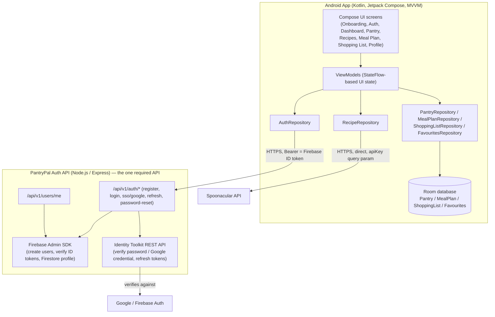

# PantryPal 🥕📱

**PROG7314 POE — Part 2: App Prototype Development**
Group: **Motivation** | Programme: BCAD3

| Name | Student Number |
|---|---|
| Samkelisiwe Hlatshwayo | st10442364 |
| Anothile Bhengu | st10440981 |
| Siyanda Nduze | st10440706 |
| Siyabonga Cebekhulu | st10440807 |

> This README is the project's core technical report for Part 2. It covers
> the app's purpose, architecture, how version control / CI was set up, and
> how to build and run both the Android client and its backend. It builds
> directly on the **Part 1 Research** and **Planning & Design** documents
> submitted earlier in this POE.

---

## 1. Purpose and Scope

PantryPal is an ingredient-aware recipe discovery and meal-planning Android
app. It answers one question well: **"what can I cook with what I already
have?"** — while layering weekly meal planning, an automatically generated
and aisle-organised shopping list, free nutrition visualisation, and
offline-first access on top of that core loop.

Our Part 1 competitive analysis of **BigOven**, **Mealime** and **SuperCook**
found that no single app combined all of these well: SuperCook nails
ingredient matching but has no planning or nutrition data; Mealime plans
beautifully but ignores the pantry you already own; BigOven does a bit of
everything but with an inconsistent data foundation. PantryPal's feature set
was deliberately built to close those specific gaps (see
`PROG7314-Part_1-_Research.pdf` for the full analysis).

This Part 2 submission is a **functional prototype**: it compiles and runs
on a physical Android device, implements the core minimum feature set from
our Part 1 design, and includes three custom/user-defined features. Final
production visual assets, and any features explicitly scoped for the final
POE, have been deferred as permitted by the brief.

---

## 2. API Scope (important — read this first)

Per the official POE clarification from our module lecturer:

> "There is only one API requirement for POE Part 2 and your overall POE.
> You are required to create your own API ... connected to your database
> ... required specifically for the login and registration - authentication
> functionality of your POE ... You do not need to create or use an API for
> every feature of your application."

We built the whole prototype around that clarification, and it's the single
most important thing to understand about this repository's architecture:

- **`backend/`** is a small Node.js/Express API whose *only* job is
  authentication (register, login, Google SSO, token refresh, password
  reset) and the authenticated user's profile. It's backed by **Firebase**
  via the Admin SDK, exactly as the brief's Firebase Console walkthrough
  describes.
- **Every other feature** — the pantry, weekly meal plan, shopping list,
  and favourites — is implemented entirely in the Android app's local
  **Room** database. There is no server involved, no sync step, no outbox:
  Room is simply the single source of truth for that data, which also
  means it's fully usable offline for free.
- **Recipe search/detail** calls **Spoonacular directly** from the Android
  app (not proxied through our own API), since recipe data isn't part of
  the one required API surface either.

---

## 3. Architecture



### 3.1 Why this shape?

- **Auth needs a real backend** because verifying a password or a Google
  credential, and being the single source of truth for "does this account
  exist", has to happen somewhere neither the client nor a public API key
  can be trusted with. Firebase's Admin SDK is exactly the tool for that:
  it creates/manages users server-side, and every subsequent request the
  app makes carries the Firebase ID token it was issued, which our own
  `requireAuth` middleware verifies with `admin.auth().verifyIdToken()`.
- **Everything else doesn't need one.** Pantry items, meal plans, shopping
  lists and favourites belong to exactly one device's user experience with
  no cross-device requirement in this prototype, so Room is sufficient,
  simpler, and — as a bonus — makes those screens work with zero network
  connectivity.
- **Recipe data is a third party's data**, not PantryPal's own, so there's
  no reason to put a server in the middle of it. Calling Spoonacular
  directly from the app also means one less hop of latency between the
  user tapping "search" and results appearing.

### 3.2 Project layout

```
PantryPal/
├── app/                        # Android client (open this in Android Studio)
│   └── src/main/java/com/motivation/pantrypal/
│       ├── data/
│       │   ├── local/          # Room entities + DAOs + AppDatabase
│       │   ├── remote/         # ApiService (auth), SpoonacularApiService (recipes), DTOs
│       │   ├── prefs/          # SessionManager (DataStore: Firebase tokens, theme, onboarding)
│       │   └── repository/     # AuthRepository (network) + local-only repos + RecipeRepository
│       ├── di/                 # Tiny hand-rolled AppContainer + ViewModelFactory
│       ├── ui/                 # One package per screen: Composable + ViewModel
│       └── MainActivity.kt     # NavHost wiring the full onboarding → auth → 5-tab wireflow
│   └── src/test/               # JUnit + MockK unit tests
├── backend/                    # The ONE required custom API: authentication, backed by Firebase
│   └── src/
│       ├── routes/             # auth.js (register/login/sso/refresh/reset), users.js (profile)
│       ├── services/           # identityToolkit.js - REST wrapper for password/Google verification
│       ├── middleware/         # auth.js - verifies the Firebase ID token bearer
│       └── firebaseAdmin.js    # Admin SDK initialisation
│   └── test/                   # Node test runner + Supertest (validation-branch tests)
├── .github/workflows/ci.yml    # GitHub Actions: Android build+test, backend tests
└── README.md                   # You are here
```

---

## 4. Feature Set (Part 2 minimum scope)

| Feature | Screen(s) | Data source | Status |
|---|---|---|---|
| Email/password registration & login | Register, Login | Custom API → Firebase | ✅ |
| **Google Single Sign-On (SSO)** | Login | Custom API → Firebase Identity Toolkit | ✅ (GoogleSignInClient `requestIdToken` → backend exchanges via `signInWithIdp`) |
| Session persistence across restarts | App-wide | DataStore (local) | ✅ |
| Pantry management (add/remove/edit, autocomplete) | My Pantry | Room (local) + Spoonacular (autocomplete) | ✅ |
| **Voice-activated pantry entry** (custom feature) | My Pantry | Android `SpeechRecognizer` → Spoonacular ingredient parser | ✅ |
| "What's in My Pantry?" recipe discovery | Search Results | Spoonacular (direct) | ✅ |
| **Smart Filtering** — diet, max missing ingredients (custom feature) | Search Results | Spoonacular (direct) | ✅ |
| Recipe detail w/ ingredients + steps + nutrition | Recipe Detail | Spoonacular (direct) | ✅ |
| **Nutrition visualisation** with %DV bars (custom feature) | Recipe Detail | Spoonacular (direct) | ✅ |
| Weekly meal planning calendar | Meal Plan | Room (local) | ✅ |
| Automated, aisle-organised shopping list | Shopping List | Room (local) — aggregated client-side from the meal plan | ✅ |
| Favourites with custom collections | Favourites | Room (local) | ✅ |
| **Dedicated Settings menu** (theme, dietary prefs, allergies, sync, logout) | Profile | DataStore (local) + Custom API `/users/me` (Firestore) | ✅ |

The three items in **bold** are our chosen user-defined features from the
Part 1 Innovative Features table, each with a clear research origin (see
Part 1 Research document, "Feature Adoption Strategy").

---

## 5. Tech Stack

**Android app**
- Kotlin, single-activity architecture, **Jetpack Compose** + Material 3 (light/dark theme support)
- **MVVM**: `StateFlow`-driven ViewModels, one hand-rolled `AppContainer` service locator (no Hilt, to keep the prototype's build graph simple to reason about)
- **Room** for the pantry/meal plan/shopping list/favourites (no server involved for these)
- **Retrofit + OkHttp**, two separate clients:
  - one for our own auth API, with an interceptor attaching the stored Firebase ID token as a Bearer header
  - one for Spoonacular, with an interceptor attaching the API key as a query param
  - both log every request/response via `HttpLoggingInterceptor`, so the "Web Services" round-trip is visible in Logcat for the demo
- **DataStore Preferences** for session tokens and settings
- **Google Play Services Auth** for SSO (requests a Google ID token, not a server auth code)
- Android `SpeechRecognizer` for voice pantry entry
- **JUnit 4 + MockK + kotlinx-coroutines-test** for unit tests
- `minSdk 27` (Android 8.1) / `targetSdk 34` (Android 14), per the Part 1 non-functional requirements

**Backend — PantryPal's one required custom API**
- Node.js 20 + Express
- **Firebase Admin SDK** — creates/manages users, verifies every incoming
  request's ID token, reads/writes each user's profile in **Firestore**
- **Firebase Identity Toolkit REST API** — the Admin SDK deliberately can't
  verify a password or a Google credential itself (it's meant to run
  server-side, trusted), so `backend/src/services/identityToolkit.js` calls
  the same REST endpoints the official Firebase client SDKs call under the
  hood to do that, and to refresh tokens / send password-reset emails
- **Node's built-in test runner + Supertest** for integration tests

---

## 6. Getting Started

### 6.1 Set up your Firebase project

1. Create a project at <https://console.firebase.google.com>.
2. **Authentication** → Sign-in method → enable **Email/Password** and
   **Google**.
3. **Firestore Database** → create a database (test mode is fine for a
   prototype).
4. **Project Settings → General** → copy the **Web API Key**.
5. **Project Settings → Service Accounts → Firebase Admin SDK** → select
   **Node.js** → **Generate new private key**. This downloads a JSON file —
   that's your `serviceAccountKey.json`.
6. **Project Settings → General → Your apps** → add an Android app with
   package name `com.motivation.pantrypal`, and note the **Web client ID**
   that Firebase auto-creates when you enabled Google sign-in above (Google
   Cloud Console → APIs & Services → Credentials → OAuth 2.0 Client IDs →
   the one of type "Web application").

### 6.2 Backend API

```bash
cd backend
cp .env .env
# Move your downloaded key to backend/serviceAccountKey.json (already git-ignored), then:
#   GOOGLE_APPLICATION_CREDENTIALS=./serviceAccountKey.json
# Paste your Web API Key into FIREBASE_WEB_API_KEY, and your project ID into FIREBASE_PROJECT_ID.
npm install
npm run dev        # starts on http://localhost:3000
```

### 6.3 Android app

1. Open the `PantryPal/` root folder in Android Studio (Koala or newer).
2. In `app/src/main/res/values/strings.xml`, replace `default_web_client_id`
   with the **Web client ID** from step 6.1.6 above (the same value the
   backend uses to verify Google credentials).
3. Add your Spoonacular key (free at
   <https://spoonacular.com/food-api/console#Dashboard>) to your own
   `local.properties` (see `local.properties.example`):
   ```
   spoonacular.apiKey=YOUR_SPOONACULAR_API_KEY
   ```
4. Run on an emulator or a physical device with USB debugging enabled.
   - The **debug** build variant points at `http://10.0.2.2:3000/`, which
     resolves to your host machine's `localhost` from the Android emulator,
     so the local backend above works out of the box.
   - On a **physical device**, change `API_BASE_URL` in
     `app/build.gradle.kts` to your machine's LAN IP or a deployed backend
     URL.
5. Build & run. First launch shows onboarding → register or log in
   (including "Continue with Google (SSO)") → the 5-tab dashboard.

### 6.4 Running the tests locally

```bash
# Android unit tests
./gradlew testDebugUnitTest
# (first run: `gradle wrapper --gradle-version 8.7` to generate the wrapper jar,
#  since it isn't committed to the repository — see gradlew for why.)

# Backend tests (validation-branch tests; no real Firebase project needed - see test/auth.test.js)
cd backend && npm install && npm test
```

---

## 7. Version Control & CI/CD

- The repository was initialised with a proper `README.md` from the start
  (no ZIP submissions or manual uploads) and developed with regular, small,
  descriptive commits as features were built — see the commit history.
- **`.github/workflows/ci.yml`** runs on every push/PR to `main` and
  `develop` and has two jobs:
  1. **`android`** — sets up JDK 17 + the Android SDK, bootstraps the
     Gradle wrapper, runs `./gradlew testDebugUnitTest`, then
     `./gradlew assembleDebug`, and uploads the resulting APK and test
     reports as build artifacts.
  2. **`backend`** — installs Node dependencies and runs the Supertest
     suite. These tests exercise the auth API's request-validation
     branches (missing fields, missing bearer token, etc.) using a
     syntactically-valid-but-fake service account fixture, so they run in
     any CI environment without needing real Firebase secrets.

---

## 8. REST API Reference

| Method | Path | Purpose |
|---|---|---|
| `POST` | `/api/v1/auth/register` | Create a Firebase user + Firestore profile, return a session |
| `POST` | `/api/v1/auth/login` | Verify email/password via Identity Toolkit, return a session |
| `POST` | `/api/v1/auth/sso/google` | Exchange a Google ID token for a Firebase session |
| `POST` | `/api/v1/auth/refresh` | Exchange a refresh token for a new ID token |
| `POST` | `/api/v1/auth/password-reset/request` | Trigger Firebase's hosted password-reset email flow |
| `GET` | `/api/v1/users/me` | Fetch the caller's profile (dietary prefs, allergies, theme) |
| `PATCH` | `/api/v1/users/me` | Update the caller's profile — the Settings screen's save endpoint |
| `DELETE` | `/api/v1/users/me` | Delete the caller's account |

Every route above except `register`/`login`/`sso`/`refresh`/`password-reset`
requires `Authorization: Bearer <Firebase ID token>`.

---

## 9. Video Demonstration Checklist

Per the Part 2 brief, our recorded demo (live, on a physical device, with
voice-over) covers:

- [ ] **Authentication** — registering a new account and logging in via
      Google SSO, showing the corresponding user appear in the Firebase
      Console's Authentication tab.
- [ ] **Application State** — changing dark/light theme and dietary
      preferences in Settings, restarting the app, and showing they persisted
      (and showing the Firestore document update in the Firebase Console).
- [ ] **Web Services** — the register/login round trip: showing the Logcat
      network trace of the request hitting our custom API, and the backend's
      own console log of the request.
- [ ] **Data Verification** — showing the same authenticated user reflected
      in (a) the running app, (b) the Firebase Console's Authentication and
      Firestore tabs, and (c) a direct `curl`/Postman call to
      `GET /api/v1/users/me` with that user's token.
- [ ] **Custom Scope** — voice-activated pantry entry, Smart Filtering, and
      the nutrition visualisation screen.

---

## 10. Known Limitations of the Prototype

- Microsoft SSO is not implemented (Google SSO only), per the brief's
  allowance to scope custom/optional features sensibly for a prototype.
- Push notifications and drag-and-drop meal-plan reordering are simplified
  or omitted, per the brief's allowance to exclude features reserved for
  the final POE phase.
- Production visual assets (finalised logo, high-fidelity imagery) are
  deferred to the final POE, as permitted.
- The shopping list's aisle categorisation uses a simple keyword map rather
  than a per-ingredient Spoonacular lookup, to conserve the free API quota.

---

## 11. References

See `PROG7314-Part_1-_Research.pdf` and
`PROG7314-Part_1-Planning___Design.pdf` for the full reference list
(Spoonacular API docs, Firebase Auth/Admin SDK docs, competitor app
reviews, etc.) that informed this implementation.
